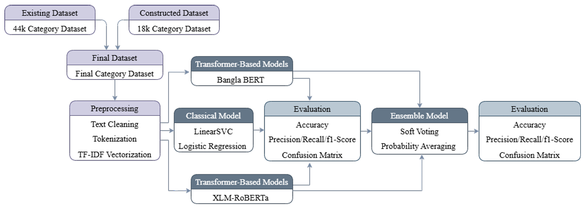

# Bangla Cyberbullying Detection using Transformer-Based Models

<p align="center">
AI-based detection of abusive Bangla social media comments using NLP and Transformer models
</p>

<p align="center">


</p>

---

# Project Overview

Cyberbullying has become a serious issue across modern social media platforms. Harmful comments and abusive language can negatively impact individuals and communities. Detecting such content manually is difficult due to the massive volume of online communication.

This research project focuses on detecting **Bangla cyberbullying comments** using **Natural Language Processing (NLP)** and **Transformer-based deep learning models**.

The project compares **classical machine learning models** with **state-of-the-art transformer architectures**, and introduces an **ensemble approach** that significantly improves classification performance.

The final ensemble system achieves **92.20% accuracy** for Bangla cyberbullying detection.

---

# System Architecture

The overall system pipeline used in this research is illustrated below.

<p align="center">

</p>

The architecture includes the following major components:

• Dataset construction and merging  
• Text preprocessing and feature extraction  
• Classical machine learning models  
• Transformer-based models (BERT and XLM-R)  
• Ensemble learning using soft voting  
• Performance evaluation using multiple metrics  

This modular pipeline allows fair comparison between traditional NLP methods and modern transformer-based approaches.

---

# Problem Statement

Detecting cyberbullying in Bangla social media text is challenging due to several linguistic and contextual factors:

• Informal language usage  
• Slang and dialect variations  
• Code-mixed Bangla–English text  
• Spelling variations  
• Context-dependent abusive expressions  

Most existing cyberbullying detection systems focus on **English datasets**, while research for **Bangla cyberbullying detection remains limited**.

This research aims to address this gap by developing an AI-based system capable of identifying abusive Bangla social media comments.

---

# Dataset Construction

A structured dataset construction pipeline was used to ensure label consistency and experimental reliability.

### Dataset Pipeline

44k Category Dataset  
↓  
18k Binary Dataset  
↓  
18k Converted Category Dataset  
↓  
Final Dataset (60,153 Samples)

The final dataset contains **60,153 Bangla social media comments** annotated into cyberbullying categories.

---

# Dataset Categories

| Label | Category |
|------|----------|
| 0 | Not Bully |
| 1 | Threat |
| 2 | Religious |
| 3 | Troll |
| 4 | Sexual |

The dataset reflects realistic Bangla social media language patterns including slang expressions, dialect variations, and code-mixed Bangla-English text.

---

# Data Preprocessing

Several preprocessing steps were applied before training the models:

• Lowercase normalization  
• Special character removal  
• Duplicate removal  
• Tokenization  
• Label encoding  
• Dataset splitting  

For transformer models, minimal preprocessing was used to preserve contextual meaning.

---

# Models Used

This research evaluates both classical machine learning approaches and modern transformer-based models.

---

## Classical Machine Learning

Traditional NLP models were implemented as baseline systems.

Algorithms used:

• TF-IDF Feature Extraction  
• Linear Support Vector Machine (LinearSVC)  
• Logistic Regression  

A **two-stage classification architecture** was used:

Stage 1 → Binary Classification (Bully vs Not Bully)  
Stage 2 → Multi-Class Classification (Bullying category detection)

---

## Transformer Models

### BERT

Bidirectional Encoder Representations from Transformers (BERT) captures contextual relationships between words in a sentence using bidirectional self-attention.

Advantages:

• Context-aware embeddings  
• Pretrained language knowledge  
• Strong NLP performance

---

### XLM-RoBERTa

XLM-RoBERTa is a multilingual transformer pretrained on large-scale cross-lingual datasets.

Advantages:

• Multilingual contextual understanding  
• Robust performance for low-resource languages  
• Improved minority class detection

---

## Ensemble Model

To improve classification accuracy and stability, a **soft-voting ensemble model** was implemented by combining predictions from BERT and XLM-R.

The ensemble probability is calculated as:

```
P_ensemble = w1 * P_BERT + w2 * P_XLMR
```

Optimal weights used:

BERT = 0.475  
XLM-R = 0.525  

This approach leverages the strengths of both transformer models.

---

# Model Performance

| Model | Accuracy |
|------|----------|
| Classical (Binary Stage) | 75.94% |
| Classical (Multi-Class Stage) | 57.44% |
| BERT | 82.47% |
| XLM-R | 84.25% |
| Ensemble | **92.20%** |

Transformer-based models significantly outperform classical machine learning approaches.

The ensemble model achieves the **highest performance and strongest generalization capability**.

---

# Real-Time Demonstration

A real-time cyberbullying detection interface was implemented using **Streamlit**.

### Real-Time Workflow

1. User inputs Bangla comment  
2. Text is tokenized using pretrained tokenizer  
3. BERT and XLM-R generate probability predictions  
4. Ensemble model combines probabilities  
5. The final predicted category is returned

This demonstrates the **practical deployment capability** of the proposed system.

---

# Technologies Used

| Technology | Purpose |
|-----------|--------|
| Python | Programming language |
| PyTorch | Deep learning framework |
| HuggingFace Transformers | Transformer models |
| Scikit-learn | Classical ML models |
| Pandas | Data processing |
| NumPy | Numerical computation |
| Matplotlib | Visualization |
| Streamlit | Real-time interface |

---

# Project Structure

```
bangla-cyberbullying-detection
│
├── dataset
├── models
├── notebooks
├── figures
│   └── system_architecture.png
├── tables
├── streamlit_app
└── README.md
```

---

# Future Work

Potential future improvements include:

• Expanding the Bangla cyberbullying dataset  
• Exploring advanced transformer architectures  
• Multimodal cyberbullying detection (text + image)  
• Integration with social media moderation systems  

---

# Author

Tamjidul Hasan  

Research Interests:

• Natural Language Processing  
• Machine Learning  
• Cyberbullying Detection  

---

# License

This project is intended for **academic and research purposes**.
